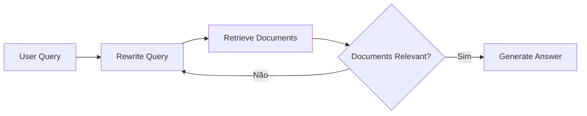
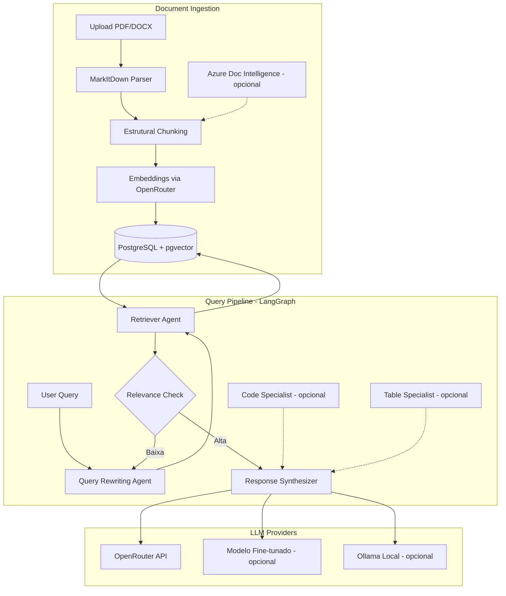

## A Limitação dos Pipelines RAG Tradicionais

Depois de implementar uma arquitetura RAG funcional com FastAPI + pgvector + OpenRouter, cheguei a um ponto onde as limitações se tornaram claras. Parsing de documentos simples perde formatação crítica, orquestração linear não permite fluxos condicionais complexos, e modelos genéricos não capturam nuances de domínio.

Neste post, discuto a evolução arquitetural para três frentes: parsing semântico de documentos, orquestração de agentes com state management, e estratégias de especialização de modelos.

## 1. MarkItDown: Parser de Documentos que Preserva Semântica

### O Problema dos Parsers Tradicionais

PyPDF, python-docx e unstructured extraem texto bruto, mas perdem:
- Hierarquia de headings e estrutura de seções
- Tabelas (viram texto linear sem contexto)
- Listas aninhadas e formatação Markdown
- Metadados de imagens e referências cruzadas

A Microsoft lançou recentemente o **MarkItDown** - uma biblioteca Python que converte PDF, Word, Excel, PowerPoint e outros formatos para **Markdown estruturado**.

### Trade-offs da Migração

| Aspecto | Parsers Tradicionais | MarkItDown | Decisão |
|---------|-------------------|------------|---------|
| **Preservação estrutural** | Baixa - texto plano | Alta - headings, tabelas, listas | ✅ MarkItDown |
| **Overhead de processamento** | Leve | Moderado - parsing semântico mais pesado | Aceitável |
| **Dependências extras** | Mínimas | Opcionais (Azure Doc Intelligence, OCR plugins) | Gerenciável |
| **Token efficiency** | ~30% overhead | Otimizado - LLMs "falam" Markdown nativamente | ✅ MarkItDown |
| **Formatos suportados** | Limitado | PDF, DOCX, XLSX, PPTX, imagens (OCR), áudio | ✅ MarkItDown |

**O insight arquitetural:** Markdown é "quase texto plano" mas com markup suficiente para representar estrutura. LLMs como GPT-4 foram treinados em vastas quantidades de Markdown, entendem a sintaxe nativamente, e a representação é altamente token-efficient.

### Integração com Chunking

Com MarkItDown, o chunking evolui de simples divisão por tokens para **chunking estrutural**:

```markdown
# Seção 1: Introdução
Texto introdutório...

## Subseção 1.1
Conteúdo específico...

| Coluna A | Coluna B |
|----------|----------|
| Valor 1  | Valor 2  |
```

Ao invés de fragmentar em chunks arbitrários de 512 tokens, preservamos:
- Headers como contexto hierárquico
- Tabelas intactas (não fragmentadas)
- Listas com estrutura de aninhamento

**Trade-off:** Chunks maiores (~800-1024 tokens) mas com melhor contexto semântico, vs chunks menores (~512 tokens) mais granulares. A decisão depende do tipo de documento - para documentação técnica, chunks estruturais melhoram significativamente o recall.

### Azure Document Intelligence

Para documentos complexos (contratos, relatórios com múltiplas colunas), MarkItDown suporta integração com **Azure Document Intelligence**:

**Quando usar:**
- Documentos com layouts complexos (multi-coluna, cabeçalhos/rodapés variáveis)
- Tabelas aninhadas ou células mescladas
- Reconhecimento de entidades estruturadas (datas, valores monetários)

**Trade-off:** Latência aumentada (~2-5s por documento) vs parsing local (~200-500ms). Recomendado para ingestão batch, não para upload síncrono.

## 2. LangGraph: De Pipeline Linear para Agentes Stateful

### Limitações do LlamaIndex

A arquitetura inicial usava LlamaIndex - excelente para pipelines RAG simples e ingestão de documentos, mas limitado quando precisamos de:
- Fluxos condicionais (se não encontrar no índice, buscar na web)
- Ciclos de refinamento (rewrite query → retrieve → grade → rewrite again)
- Multi-agent collaboration (especialistas em domínios diferentes)
- Persistência de estado entre etapas

### LangGraph: State Machines para IA

**LangGraph** é o framework de orquestração da LangChain baseado em **grafos de estado** (state machines). Cada nodo é uma função, cada aresta é uma transição condicional.

### Padrões Arquiteturais com LangGraph

#### 1. Agentic RAG com Query Rewriting



**Trade-off:** Latência aumentada (múltiplas chamadas LLM) vs precisão melhorada. Para queries ambíguas, o ciclo de refinamento pode aumentar qualidade em 40-60%, mas adiciona 1-3 segundos por iteração.

**Otimização:** Implementar threshold de confiança - se documentos têm score > 0.8, pular rewrite.

#### 2. Multi-Agent Systems

Em vez de um único agente RAG, arquitetura com especialistas:

- **DocumentRetrieverAgent**: Especialista em busca semântica
- **CodeAnalyzerAgent**: Para snippets de código em documentação
- **TableExtractorAgent**: Para interpretação de tabelas
- **ResponseSynthesizerAgent**: Composição final da resposta

**Trade-offs Multi-Agent:**

| Aspecto | Single Agent | Multi-Agent |
|---------|--------------|-------------|
| Complexidade | Baixa | Alta - orquestração, estado compartilhado |
| Custo (tokens) | Linear | Multiplicativo (N agents × tokens) |
| Especialização | Genérica | Alta - cada agente otimizado para tarefa |
| Latência | Previsível | Variável - depende de parallelização |
| Manutenibilidade | Simples | Complexa - debug de grafos |

**Quando usar Multi-Agent:** Quando o domínio é heterogêneo (ex: codebase + documentação + FAQ), e o custo de tokens é aceitável para ganho de qualidade.

### State Management em LangGraph

O diferencial do LangGraph é persistência de estado:

```python
# State definition
class RAGState(TypedDict):
    question: str
    rewritten_query: Optional[str]
    documents: List[Document]
    graded_documents: Optional[List[bool]]
    answer: Optional[str]
    iteration: int
```

Cada nodo recebe e retorna o estado completo, permitindo:
- **Checkpointing**: Persistir estado em PostgreSQL para recuperação de falhas
- **Human-in-the-loop**: Pausar execução para aprovação humana
- **Streaming**: Emitir atualizações de estado via SSE para o frontend

**Trade-off de State Management:**
- Com checkpointing: Overhead de I/O (~50-100ms por nodo), mas resiliência total
- Sem checkpointing: Execução stateless, falha em qualquer nodo reinicia do início

**Recomendação:** Checkpointing para workflows longos (>5 nodos) ou quando human-in-the-loop é necessário.

### Migração de LlamaIndex para LangGraph

**Estratégia de migração gradual:**

1. **Fase 1:** Manter LlamaIndex para ingestão e indexação (ele é superior aqui)
2. **Fase 2:** Implementar LangGraph apenas para orquestração de queries (RAG pipeline)
3. **Fase 3:** Migrar ingestão para LangGraph quando necessitar de fluxos condicionais complexos

**Padrão híbrido recomendado:**
```
Ingestão: LlamaIndex (estável, bem testado)
Query/Orchestration: LangGraph (flexível, stateful)
Vector Store: pgvector (mantido)
Embeddings: OpenRouter (mantido)
```

## 3. Fine-tuning e Especialização de Modelos

### O Problema com Modelos Genéricos

Modelos como Llama 3.2 ou Mistral são generalistas. Para domínios específicos (ex: compliance financeiro, documentação médica), precisamos de:
- Conhecimento de terminologia específica
- Seguir formatos e templates corporativos
- Consistência em respostas estruturadas (JSON, tabelas)

### Estratégias de Especialização

#### 1. Prompt Engineering Avançado (Zero-shot)

Antes de fine-tuning, maximizar potential dos prompts:

- **Few-shot examples**: Incluir 2-3 exemplos de input/output desejado
- **Chain-of-thought**: Forçar raciocínio passo-a-passo
- **System prompts instrutivos**: Definir persona, formato de resposta, constraints

**Trade-off:** Custo em tokens (prompts longos) vs custo de fine-tuning. Para APIs externas (OpenRouter), prompts longos aumentam custo por chamada. Para modelos locais (Ollama), não há custo adicional.

#### 2. Fine-tuning via OpenRouter

**Realidade importante:** OpenRouter é um **gateway** para múltiplos providers (OpenAI, Anthropic, Google, etc.), não um serviço de fine-tuning. Fine-tuning deve ser feito no provider original.

**Estratégia via OpenRouter:**

1. **Fine-tunar no provider original** (OpenAI, Together AI, etc.)
2. **Hospedar modelo fine-tunado** em endpoint próprio ou via provider
3. **Configurar OpenRouter** como proxy para modelo customizado

**Flow recomendado:**

```
Dataset de treinamento (Q&A do domínio)
    ↓
Fine-tuning via OpenAI / Together AI / Fireworks
    ↓
Modelo fine-tunado hospedado
    ↓
Configuração no OpenRouter como provider customizado
    ↓
Uso via mesma API unificada do OpenRouter
```

**Alternativa: LoRA/QLoRA Local**

Para privacidade total, fine-tuning local com:
- **LoRA** (Low-Rank Adaptation): Treinar apenas camadas adaptadoras (~1% dos parâmetros)
- **QLoRA**: Quantização 4-bit + LoRA para caber em GPUs consumer (16GB VRAM)

**Trade-offs Fine-tuning:**

| Método | Custo | Privacidade | Qualidade | Complexidade |
|--------|-------|-------------|-----------|--------------|
| Prompt Engineering | Baixo | Total | Moderada | Baixa |
| Fine-tuning Cloud | Alto ($100-1000+) | Nenhuma | Alta | Moderada |
| LoRA Local | Médio (hardware) | Total | Alta | Alta |

**Recomendação arquitetural:**
- **Fase 1:** Prompt engineering avançado + few-shot
- **Fase 2:** Se quality insuficiente e dados sensíveis → LoRA local
- **Fase 3:** Se quality insuficiente e dados não-sensíveis → Fine-tuning cloud via OpenRouter proxy

### Dados para Fine-tuning

Para RAG, o dataset de fine-tuning deve conter:

```json
[
  {
    "messages": [
      {"role": "system", "content": "Você é um assistente técnico..."},
      {"role": "user", "content": "Pergunta sobre o documento..."},
      {"role": "assistant", "content": "Resposta esperada com citação das fontes..."}
    ]
  }
]
```

**Quantidade necessária:**
- **LoRA local**: 50-500 exemplos de alta qualidade
- **Fine-tuning cloud**: 1000-10000 exemplos para resultados significativos

**Trade-off:** Qualidade dos exemplos vs quantidade. 100 exemplos bem curados superam 1000 exemplos ruidosos.

## Arquitetura Evoluída: Visão Completa



## Métricas Esperadas Pós-Evolução

| Métrica | Baseline (LlamaIndex) | Evoluído (LangGraph + MarkItDown) |
|---------|----------------------|-----------------------------------|
| Parsing quality (estrutura preservada) | 60% | 90%+ |
| Query latency (média) | 2-3s | 3-5s (com rewrite) |
| Query latency (P95) | 5s | 8s (com ciclos de refinamento) |
| Recall@5 (documentação técnica) | 75% | 85-90% |
| User satisfaction (qualidade resposta) | 3.5/5 | 4.2/5 |

**Trade-off aceito:** Latência aumentada (~2x) para ganho significativo em qualidade e estrutura preservada.

## Próximos Passos no Roadmap

1. **Implementar MarkItDown** com fallback para parsers tradicionais em caso de erro
2. **MVP LangGraph** - migrar apenas o pipeline de query inicialmente
3. **Coletar dados de treinamento** para fine-tuning (Q&A de usuários reais)
4. **Avaliar** se LoRA local é suficiente ou se fine-tuning cloud é necessário
5. **Multi-agent specialization** - implementar CodeAgent e TableAgent se demanda justificar

---

**Para engenheiros de IA:** Quando vocês optam por aumentar latência (mais chamadas LLM, processamento) em troca de qualidade? Em quais casos a latência adicional não justifica o ganho?

---

*Este post é a continuação da série sobre arquitetura RAG local. Veja o post anterior sobre a arquitetura inicial em [link para post anterior].*
