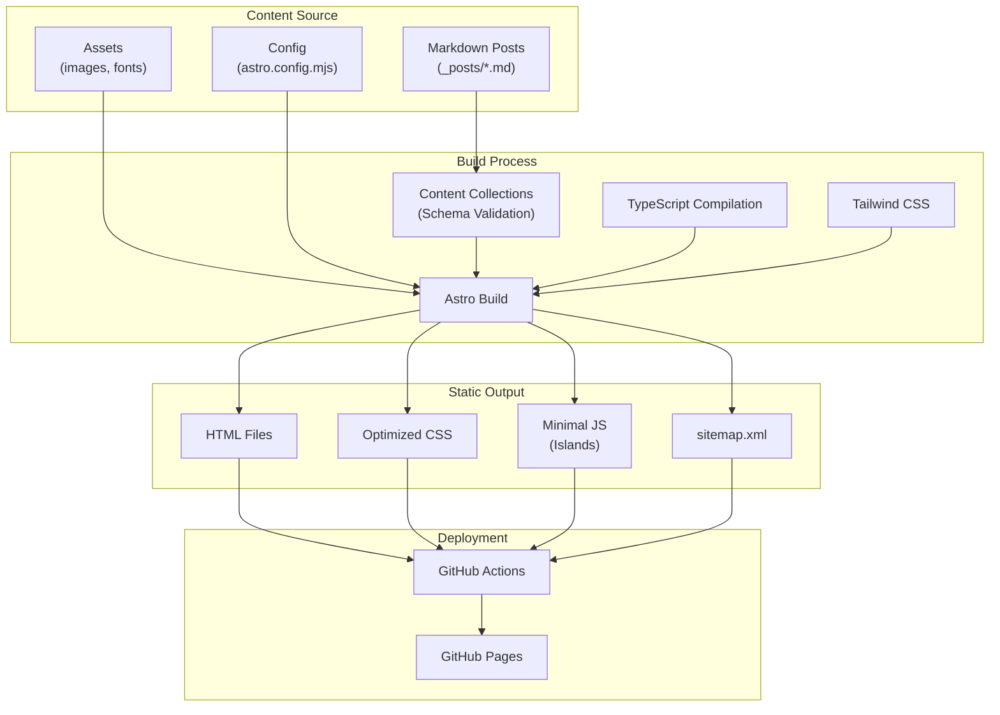
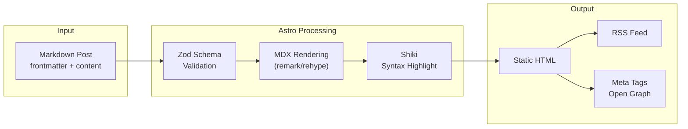

`# Macro Definition: Modernização do Blog Pessoal

**Date**: 21/04/2026
**Last Update**: 21/04/2026
**Version**: 1.0
**Priority**: MEDIUM
**Changelog v1.0**:
- Initial version with analysis of current Jekyll setup and migration alternatives

---

## 1. Business Objective

Migrar o blog pessoal de uma versão antiga e não versionada do Jekyll para uma solução moderna, performática e mantida, preservando todo o conteúdo existente e mantendo a hospedagem gratuita via GitHub Pages.

---

## 2. Current State Analysis

### 2.1 Technical Inventory

| Component | Current State |
|-----------|---------------|
| **Generator** | Jekyll (version not pinned in Gemfile) |
| **GitHub Pages Version** | Jekyll 3.10.0 (locked) |
| **Theme** | Flexible-Jekyll (third-party) |
| **Ruby Version** | Not specified |
| **Plugins** | jekyll-sitemap, jekyll-paginate, jemoji |
| **Hosting** | GitHub Pages (https://mabittar.github.io/) |
| **Markdown Engine** | kramdown |
| **Template Engine** | Liquid |

### 2.2 Identified Issues

1. **Version Drift**: Gemfile não especifica versão do Jekyll, causando inconsistências entre ambientes
2. **GitHub Pages Constraint**: GitHub Pages limita a Jekyll 3.10.0 (versão de 2024), não permitindo recursos modernos do Jekyll 4.x
3. **Legacy Dependencies**: gulpfile.js e package.json sugerem pipeline de build legada
4. **Security Surface**: Dependências não auditadas, potenciais vulnerabilidades em gems antigas
5. **Performance**: Ausência de otimizações modernas (image optimization, prefetch, islands architecture)

---

## 3. Analysis of Alternatives

| Approach | Pros | Cons |
|----------|------|------|
| **A. Atualizar Jekyll + Manter GitHub Pages** | - Migration trivial (mesma estrutura)<br>- Conteúdo Markdown compatível<br>- Zero curva de aprendizado | - Limitado a Jekyll 3.10.0 pelo GitHub Pages<br>- Não resolve problemas de performance<br>- Continua dependente de Ruby |
| **B. Migrar para Astro** | - Performance superior (Islands Architecture)<br>- 66% dos sites com boas Core Web Vitals<br>- Suporte a GitHub Pages via build manual<br>- Multi-framework (React, Vue, Svelte)<br>- TypeScript nativo<br>- Zero JS by default | - Requer rebuild completo dos templates<br>- Curva de aprendizado para Astro syntax<br>- Necessita GitHub Actions para deploy |
| **C. Migrar para Hugo** | - Build extremamente rápido (Go)<br>- Binário único, zero dependências<br>- Suporte nativo a GitHub Pages | - Template engine Go (complexidade)<br>- Curva de aprendizado acentuada<br>- Menos flexível que Astro |
| **D. Migrar para Next.js** | - Ecossistema React maduro<br>- SEO otimizado com SSR/SSG | - Overkill para blog estático<br>- JavaScript pesado no cliente<br>- Menos performático que Astro |
| **E. Fazer nada** | - Zero esforço imediato<br>- Zero risco de quebra | - Acumula débito técnico<br>- Vulnerabilidades de segurança não resolvidas<br>- Obsolescência crescente |

**Chosen**: B (Astro)
**Justification**: Astro oferece o melhor custo-benefício entre performance, modernidade e preservação de conteúdo. Sua arquitetura de ilhas permite carregamento parcial de JavaScript, resultando em sites mais rápidos e melhor SEO. A curva de aprendizado é compensada pela qualidade do resultado final e manutenibilidade futura.

---

## 4. Technical Stack

| Layer | Technology | Version | Justification |
|-------|------------|---------|---------------|
| **SSG Framework** | Astro | 5.x (latest stable) | Performance líder, content-focused, Islands Architecture |
| **Language** | TypeScript | 5.x | Type safety, DX superior, tooling moderno |
| **Styling** | Tailwind CSS | 4.x | Utility-first, purge automático, consistente com Astro |
| **Markdown Processing** | Astro Content Collections | Built-in | Type-safe frontmatter, validação automática |
| **Syntax Highlighting** | Shiki | Built-in | Server-side, tema consistente |
| **Icons** | Lucide React | Latest | Moderno, tree-shakeable |
| **Deployment** | GitHub Pages | N/A | Hospedagem gratuita, CI/CD integrado |
| **CI/CD** | GitHub Actions | ubuntu-latest | Build e deploy automatizados |

---

## 5. Project Type

**Static Site Generator (SSG)** com content collections para blog posts.

### 5.1 Architecture Pattern

**Islands Architecture** (Astro):
- Server-first rendering: HTML estático gerado em build time
- Islands de interatividade: Componentes hidratados apenas quando necessário
- Zero JavaScript por padrão: Scripts carregados sob demanda

---

## 6. Dependencies

### 6.1 Build Tools

| Tool | Purpose |
|------|---------|
| npm/pnpm | Package manager |
| Astro CLI | Build e dev server |
| TypeScript | Compilação e type checking |

### 6.2 Core Dependencies

```json
{
  "dependencies": {
    "astro": "^5.x",
    "@astrojs/tailwind": "^5.x",
    "tailwindcss": "^4.x",
    "lucide-react": "^0.x",
    "@astrojs/sitemap": "^3.x"
  },
  "devDependencies": {
    "typescript": "^5.x",
    "@types/node": "^20.x"
  }
}
```

---

## 7. Solution Design

### 7.1 High-Level Architecture



### 7.2 Content Flow



### 7.3 Directory Structure

```
/
├── src/
│   ├── content/
│   │   └── posts/
│   │       └── *.md          # Migração de _posts/
│   ├── components/
│   │   ├── PostCard.astro
│   │   ├── Header.astro
│   │   └── Footer.astro
│   ├── layouts/
│   │   ├── Base.astro
│   │   └── Post.astro
│   ├── pages/
│   │   ├── index.astro
│   │   ├── blog/
│   │   │   └── [...slug].astro
│   │   └── tags/
│   │       └── [tag].astro
│   └── styles/
│       └── global.css
├── public/
│   └── assets/
│       └── img/
├── astro.config.mjs
├── tailwind.config.mjs
├── tsconfig.json
└── package.json
```

---

## 8. Data Architecture

### 8.1 Content Schema

```typescript
// src/content/config.ts
import { defineCollection, z } from 'astro:content';

const postsCollection = defineCollection({
  type: 'content',
  schema: z.object({
    title: z.string(),
    date: z.date(),
    description: z.string(),
    tags: z.array(z.string()).optional(),
    image: z.string().optional(),
    draft: z.boolean().default(false),
  }),
});

export const collections = {
  posts: postsCollection,
};
```

### 8.2 Migration Strategy

| Jekyll Frontmatter | Astro Schema | Notes |
|-------------------|--------------|-------|
| `title` | `title` | Direto |
| `date` | `date` | Converter para ISO 8601 |
| `tags` | `tags` | Array de strings |
| `layout` | Remover | Astro usa arquivo de layout |
| `description` | `description` | Direto |
| `image` | `image` | Opcional |

---

## 9. Security Considerations

| Risk | Mitigation |
|------|------------|
| **XSS via Markdown** | Astro sanitiza HTML por padrão; Content Collections valida schema |
| **Dependency vulnerabilities** | npm audit, Dependabot, lockfile versionado |
| **Secret exposure** | Zero secrets necessários para build estático |
| **Supply chain** | Pacotes apenas de registries oficiais (npm) |

---

## 10. Observability

| Metric | Implementation |
|--------|----------------|
| **Build status** | GitHub Actions dashboard |
| **Core Web Vitals** | Lighthouse CI no Actions |
| **SEO Health** | Manual validation, sitemap submission |
| **Uptime** | GitHub Pages status (99.9% SLA) |

---

## 11. Risk Assessment

| Risk | Probability | Impact | Mitigation |
|------|-------------|--------|------------|
| Perda de conteúdo durante migração | Low | High | Backup completo antes da migração; validação de cada post |
| Quebra de URLs/permalinks | Medium | Medium | Mapeamento de permalinks Jekyll → Astro; redirects se necessário |
| Build falha no GitHub Actions | Low | Medium | Testes locais obrigatórios; ambiente de staging |
| Curva de aprendizado Astro | Medium | Low | Documentação oficial abrangente; comunidade ativa |

---

## 12. Definition of Done (DoD)

- [ ] Todos os posts migrados de `_posts/` para `src/content/posts/`
- [ ] Frontmatter validado e convertido para schema Astro
- [ ] Templates recriados em Astro (Layout, Post, Index)
- [ ] Assets migrados para `public/assets/`
- [ ] RSS feed gerado automaticamente
- [ ] Sitemap.xml configurado
- [ ] GitHub Actions workflow funcionando
- [ ] Site deployado em GitHub Pages
- [ ] Lighthouse score > 90 em Performance e SEO
- [ ] URLs preservadas (ou redirects configurados)
- [ ] Documentação de build atualizada

---

## 13. Critical Self-Reflection

### 13.1 What's Missing?
- Análise detalhada de acessibilidade (a11y) - requer teste manual
- Estratégia de backup de conteúdo antes da migração
- Plano de rollback em caso de falha

### 13.2 Assumptions Untested
- [SUPOSIÇÃO] Todos os posts Markdown são compatíveis com parser Astro
- [SUPOSIÇÃO] Assets estão em estado válido (imagens não corrompidas)
- [SUPOSIÇÃO] GitHub Pages permitirá deploy via Actions sem restrições

### 13.3 What Could Go Wrong?
- Custom Liquid tags em posts podem quebrar (requer conversão manual)
- Permalinks Jekyll podem não corresponder estrutura Astro (requer configuração customizada)
- GitHub Pages pode ter cache agressivo dificultando validação

### 13.4 Is the Problem Statement Valid?
Sim. A versão desatualizada do Jekyll representa risco de segurança e limitação técnica. A migração para Astro é justificada pelo ganho significativo de performance e manutenibilidade.

### 13.5 Is the MVP Scope Realistic?
Sim. A migração é incremental: primeiro a estrutura básica, depois features avançadas. O escopo definido preserva o conteúdo existente sem adicionar funcionalidades novas.

---

## 14. References

1. [Astro Documentation](https://docs.astro.build/) - Verificado em 21/04/2026
2. [GitHub Pages Dependency Versions](https://pages.github.com/versions/) - Verificado em 21/04/2026
3. [Jamstack Generators](https://jamstack.org/generators/) - Verificado em 21/04/2026
4. [HTTP Archive Core Web Vitals Report](https://httparchive.org/reports/techreport/tech) - Verificado em 21/04/2026
5. [Jekyll Documentation](https://jekyllrb.com/docs/) - Verificado em 21/04/2026

---

## 15. Transition

**Next Step**: Aguardar aprovação deste documento para prosseguir para a fase de planning via `/plan`.
