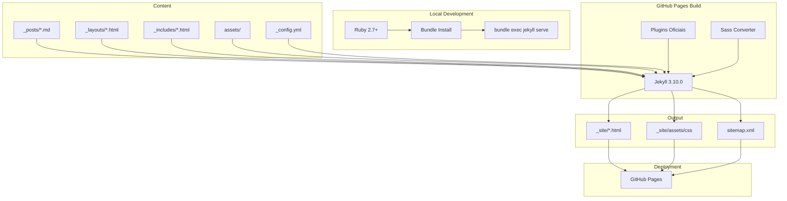

# Implementation Plan: Atualização do Jekyll para GitHub Pages

**Date**: 21/04/2026
**Last Update**: 21/04/2026
**Version**: 1.0
**Based on**: `docs/project/20250421-blog_migration_macro.md`
**Total Estimate**: 4h (~1 business day)
**Priority**: MEDIUM
**Changelog v1.0**:
- Initial version: Plano de atualização do Jekyll mantendo compatibilidade com GitHub Pages

---

## 1. Executive Summary

Atualização do blog Jekyll para uma configuração moderna e alinhada com as melhores práticas do GitHub Pages. A abordagem preserva todo o conteúdo existente enquanto elimina débito técnico e dependências legadas.

---

## 2. Analysis of Alternatives

| Approach | Pros | Cons |
|----------|------|------|
| **A. Usar github-pages gem** | - Versões gerenciadas automaticamente pelo GitHub<br>- Compatibilidade garantida<br>- Menor complexidade de manutenção<br>- Build nativo no GitHub Pages | - Limitado às versões suportadas pelo GitHub<br>- Menos flexibilidade para plugins customizados |
| **B. Jekyll direto com version pinning** | - Controle total de versões<br>- Acesso a recursos mais recentes do Jekyll | - Risco de incompatibilidade com GitHub Pages<br>- Necessidade de CI/CD manual<br>- Mais complexidade operacional |
| **C. Manter estado atual** | - Zero esforço imediato | - Débito técnico acumulado<br>- Dependências de segurança não resolvidas<br>- gulpfile.js obsoleto (Gulp 3.x deprecated) |

**Chosen**: A (github-pages gem)
**Justification**: A gem github-pages é mantida pelo próprio GitHub e garante compatibilidade perfeita com o ambiente de build do GitHub Pages, eliminando surpresas em produção.

---

## 3. Current State Dependencies

### 3.1 Gemfile Atual
```ruby
source 'https://rubygems.org'
gem 'jekyll'

group :jekyll_plugins do
  gem "jekyll-sitemap"
  gem "jekyll-paginate"
  gem "jemoji"
end
```
**Problema**: Versão do Jekyll não especificada. GitHub Pages usa Jekyll 3.10.0, mas ambiente local pode usar versão diferente.

### 3.2 gulpfile.js Legado
- Gulp 3.x (deprecated desde 2018)
- Sass compilation local
- Imagemin para otimização de imagens
- BrowserSync para desenvolvimento

**Problema**: Gulp 3.x possui vulnerabilidades de segurança conhecidas. Pipeline de build duplicada (GitHub Pages já faz build automaticamente).

### 3.3 package.json Legado
```json
{
  "dependencies": {
    "browser-sync": "^2.18.13",
    "child_process": "^1.0.2",
    "gulp": "^3.9.1",
    "gulp-autoprefixer": "^4.0.0",
    "gulp-cache": "^0.4.6",
    "gulp-imagemin": "^3.2.0",
    "gulp-sass": "^3.1.0",
    "imagemin-pngquant": "^5.0.0"
  }
}
```
**Problema**: Dependências de build desnecessárias. GitHub Pages já processa Sass e gera o site.

---

## 4. Solution Design

### 4.1 High-Level Architecture



### 4.2 Target State

| Component | Current | Target |
|-----------|---------|--------|
| **Jekyll Version** | Unspecified | 3.10.0 (via github-pages) |
| **Gemfile** | Simple | github-pages gem |
| **Build Tool** | Gulp 3.x | Jekyll nativo |
| **Package.json** | Build dependencies | Empty/Removed |
| **Plugins** | Manual declaration | github-pages bundle |
| **Ruby Version** | Unspecified | 2.7+ (documented) |

---

## 5. Development Roadmap

### [TASK-01] Atualizar Gemfile para github-pages gem
**Estimate**: 30min
**Objective**: Substituir gem 'jekyll' por 'github-pages' para garantir compatibilidade com GitHub Pages

**Files**:
- `Gemfile` (modify)
- `Gemfile.lock` (delete - será regenerado)

**Steps**:
1. Fazer backup do Gemfile atual: `cp Gemfile Gemfile.backup`
2. Atualizar Gemfile com conteúdo:
   ```ruby
   source 'https://rubygems.org'
   gem 'github-pages', group: :jekyll_plugins
   ```
3. Remover Gemfile.lock: `rm Gemfile.lock`
4. Executar `bundle install` localmente para testar
5. Verificar se bundle resolve corretamente

**Acceptance Criteria**:
- [ ] `bundle install` executa sem erros
- [ ] Gemfile.lock é gerado com github-pages e dependências
- [ ] `bundle exec jekyll --version` retorna versão compatível (3.10.0)

**Rollback**:
```bash
cp Gemfile.backup Gemfile
rm Gemfile.lock
bundle install
```

---

### [TASK-02] Remover gulpfile.js e dependências de build legadas
**Estimate**: 30min
**Objective**: Eliminar pipeline de build obsoleta (Gulp 3.x) e limpar package.json

**Files**:
- `gulpfile.js` (delete)
- `package.json` (modify)
- `package-lock.json` / `yarn.lock` (delete se existir)

**Steps**:
1. Fazer backup: `cp gulpfile.js gulpfile.js.backup && cp package.json package.json.backup`
2. Remover gulpfile.js: `rm gulpfile.js`
3. Atualizar package.json para:
   ```json
   {
     "name": "mabittar.github.io",
     "version": "1.0.0",
     "description": "Blog pessoal - Marcel Bittar",
     "private": true
   }
   ```
4. Remover lock files se existirem

**Acceptance Criteria**:
- [ ] gulpfile.js removido
- [ ] package.json sem dependências de build
- [ ] Nenhum erro ao executar `git status` (arquivos devidamente removidos do tracking)

**Rollback**:
```bash
cp gulpfile.js.backup gulpfile.js
cp package.json.backup package.json
# Restaurar lock files se necessário
```

---

### [TASK-03] Limpar e otimizar _config.yml
**Estimate**: 45min
**Objective**: Remover configurações desnecessárias e alinhar com melhores práticas do GitHub Pages

**Files**:
- `_config.yml` (modify)
- `_config_dev.yml` (evaluate/delete)

**Steps**:
1. Fazer backup: `cp _config.yml _config.yml.backup`
2. Analisar `_config_dev.yml` - se for redundante, remover
3. Revisar e otimizar `_config.yml`:
   - Manter: title, description, url, author, plugins permitidos
   - Verificar: permalink, baseurl, paginate config
   - Remover: exclude de arquivos que já não existem mais (gulpfile.js, node_modules etc)
4. Adicionar configurações recomendadas:
   ```yaml
   # Build settings
   markdown: kramdown
   kramdown:
     input: GFM
     hard_wrap: false
   ```
5. Validar que plugins listados são suportados pelo GitHub Pages

**Acceptance Criteria**:
- [ ] `_config.yml` validado com `bundle exec jekyll doctor`
- [ ] Site serve localmente sem erros: `bundle exec jekyll serve`
- [ ] `_config_dev.yml` removido se redundante

**Rollback**:
```bash
cp _config.yml.backup _config.yml
# Restaurar _config_dev.yml se foi removido
```

---

### [TASK-04] Criar arquivo .ruby-version
**Estimate**: 15min
**Objective**: Documentar versão recomendada do Ruby para desenvolvimento local

**Files**:
- `.ruby-version` (create)

**Steps**:
1. Criar arquivo `.ruby-version` com conteúdo: `2.7.0`
2. Adicionar ao .gitignore se necessário (opcional - pode ser versionado)

**Acceptance Criteria**:
- [ ] Arquivo `.ruby-version` criado
- [ ] Version managers (rbenv, rvm, asdf) reconhecem a versão

**Rollback**:
```bash
rm .ruby-version
```

---

### [TASK-05] Criar GitHub Actions workflow (opcional)
**Estimate**: 1h
**Objective**: Workflow para validação de build em PRs e branches

**Files**:
- `.github/workflows/jekyll-build.yml` (create)

**Steps**:
1. Criar diretório: `mkdir -p .github/workflows`
2. Criar workflow:
   ```yaml
   name: Build Jekyll Site
   
   on:
     push:
       branches: [ main, master ]
     pull_request:
       branches: [ main, master ]
   
   jobs:
     build:
       runs-on: ubuntu-latest
       steps:
       - uses: actions/checkout@v4
       - name: Setup Ruby
         uses: ruby/setup-ruby@v1
         with:
           ruby-version: '2.7'
           bundler-cache: true
       - name: Build site
         run: bundle exec jekyll build
   ```

**Acceptance Criteria**:
- [ ] Workflow executa sem erros em PR
- [ ] Build passa com sucesso

**Rollback**:
```bash
rm -rf .github/workflows/jekyll-build.yml
rmdir .github/workflows 2>/dev/null || true
```

---

### [TASK-06] Atualizar README.md
**Estimate**: 30min
**Objective**: Documentar setup de desenvolvimento e instruções de build

**Files**:
- `README.md` (modify)

**Steps**:
1. Preservar créditos do tema original
2. Adicionar seção de desenvolvimento:
   ```markdown
   ## Desenvolvimento

   ### Pré-requisitos
   - Ruby 2.7+
   - Bundler

   ### Setup
   ```bash
   bundle install
   bundle exec jekyll serve
   ```

   ### Deploy
   O deploy é automático via GitHub Pages ao fazer push para a branch principal.
   ```
3. Remover instruções legadas do gulp

**Acceptance Criteria**:
- [ ] README.md contém instruções claras de setup
- [ ] README.md não menciona gulp ou npm
- [ ] Links para o tema original preservados

**Rollback**:
```bash
git checkout README.md
```

---

## 6. Sequence of Commits

```bash
# [COMMIT-01] Atualizar Gemfile
git add Gemfile Gemfile.lock
git commit -m "chore(deps): atualizar Gemfile para usar github-pages gem

Substitui gem 'jekyll' por 'github-pages' para garantir
compatibilidade com GitHub Pages. Elimina necessidade de
version pinning manual."

# [COMMIT-02] Remover gulpfile.js e limpar package.json
git rm gulpfile.js
git add package.json
git commit -m "chore(build): remover pipeline gulp legada

Remove gulpfile.js e dependências de build obsoletas.
GitHub Pages já processa Sass e assets automaticamente.
Elimina vulnerabilidades do Gulp 3.x."

# [COMMIT-03] Otimizar _config.yml
git add _config.yml
if [ -f _config_dev.yml ]; then git rm _config_dev.yml; fi
git commit -m "chore(config): otimizar configuração do Jekyll

Alinha _config.yml com melhores práticas do GitHub Pages.
Remove configurações desnecessárias."

# [COMMIT-04] Adicionar .ruby-version
git add .ruby-version
git commit -m "chore(dev): adicionar .ruby-version

Documenta versão recomendada do Ruby para desenvolvimento
local consistente com GitHub Pages."

# [COMMIT-05] Adicionar GitHub Actions (opcional)
git add .github/workflows/jekyll-build.yml
git commit -m "ci(github): adicionar workflow de build

Adiciona validação automática de build em PRs e branches."

# [COMMIT-06] Atualizar README.md
git add README.md
git commit -m "docs(readme): atualizar instruções de desenvolvimento

Documenta setup moderno sem gulp. Preserva créditos do tema."
```

---

## 7. Validation Checklist

### Pre-deployment
- [ ] Site serve localmente: `bundle exec jekyll serve`
- [ ] Nenhum erro no console do Jekyll
- [ ] Todas as páginas são acessíveis (home, posts, tags)
- [ ] Assets carregam corretamente (CSS, imagens)
- [ ] Sitemap.xml é gerado em `_site/`
- [ ] Permalinks preservados (URLs não quebram)

### Post-deployment
- [ ] Site acessível em https://mabittar.github.io/
- [ ] Páginas individuais de posts funcionam
- [ ] Tags page funciona
- [ ] Feed RSS existe (se configurado)
- [ ] Sitemap acessível em /sitemap.xml

---

## 8. Risk Assessment

| Risk | Probability | Impact | Mitigation |
|------|-------------|--------|------------|
| Quebra de layout após atualização | Medium | Medium | Testar localmente antes de deploy; rollback via git |
| Permalinks alterados | Low | High | Verificar config permalink antes; testar URLs existentes |
| Plugins não suportados | Low | Medium | Validar plugins contra whitelist do GitHub Pages |
| Build falha no GitHub Pages | Low | High | Usar github-pages gem garante compatibilidade |

---

## 9. Definition of Done

- [ ] Gemfile usa github-pages gem
- [ ] gulpfile.js removido
- [ ] package.json limpo
- [ ] _config.yml otimizado
- [ ] .ruby-version criado
- [ ] README.md atualizado
- [ ] Site serve localmente sem erros
- [ ] Deploy no GitHub Pages funcionando
- [ ] URLs preservadas (nenhum 404 em posts existentes)

---

## 10. References

1. [GitHub Pages Dependency Versions](https://pages.github.com/versions/) - Verificado em 21/04/2026
2. [GitHub Pages Gem Documentation](https://github.com/github/pages-gem) - Verificado em 21/04/2026
3. [Jekyll Configuration](https://jekyllrb.com/docs/configuration/) - Verificado em 21/04/2026
4. [GitHub Pages Supported Plugins](https://pages.github.com/versions/) - Verificado em 21/04/2026

---

## 11. Transition

**Next Step**: Após aprovação deste plano, executar implementação via agente `@code` ou manualmente seguindo os commits definidos acima.

**Command**: Aguardar instrução para iniciar implementação.
